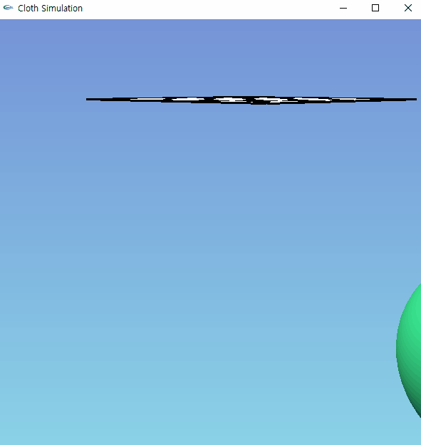
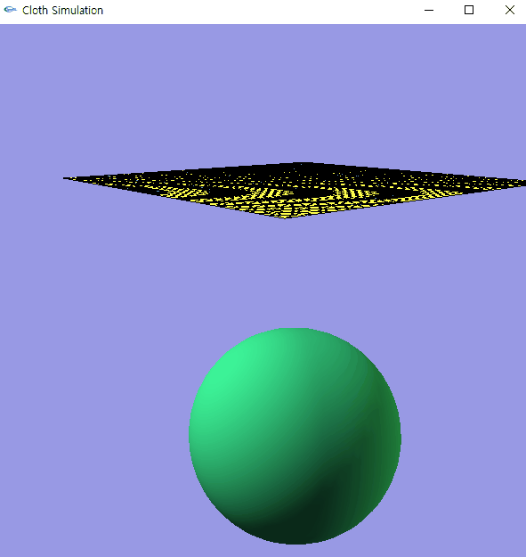

# Cloth Simulation
컴퓨터 그래픽스 수업에서 진행한 Cloth Simulation 입니다.  
참고 : https://viscomp.alexandra.dk/?p=147  
 
* 1 - cloth simulation 구현하기  
</img>   
* 2 - bending 추가하기   
</img>   
* 3 - 충돌 처리   
</img>